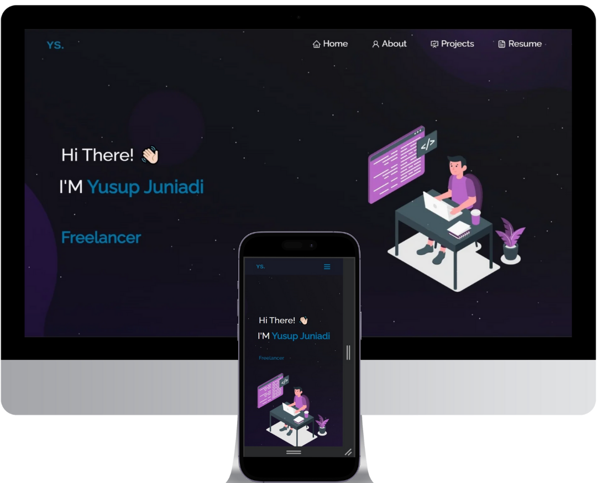

<h2 align="center">
  Portfolio Website  
  <a href="https://yusup.vercel.app/" target="_blank">yusup.io</a>
</h2>

  

 

## Built With

My personal portfolio website is hosted at <a href="https://yusup.vercel.app/" target="_blank">yusup.io</a> It showcases my GitHub projects, highlights my resume, and presents my technical skills. 

This portfolio was developed using the following technologies:

- React.js: For building dynamic and interactive user interfaces.
- Node.js: As the runtime environment for server-side JavaScript.
- Express.js: For handling server routing and API requests.
- VCSS3: For modern and responsive web design.
- Visual Studio Code (VSCode): As the primary code editor.
- Vercel: For seamless hosting and deployment.